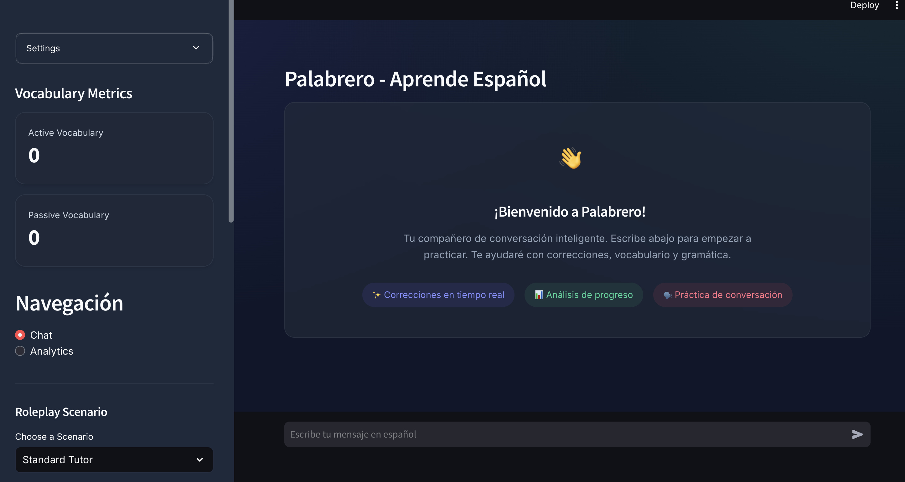
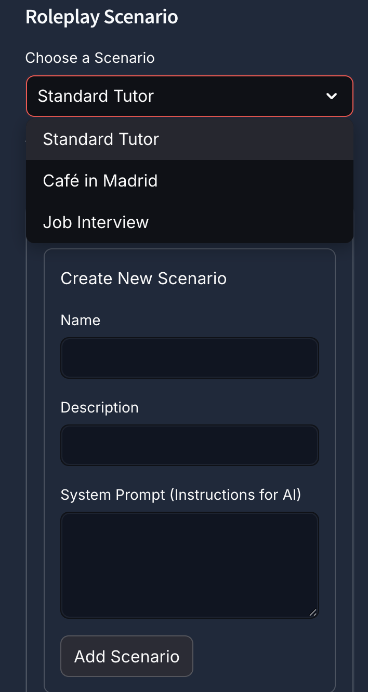
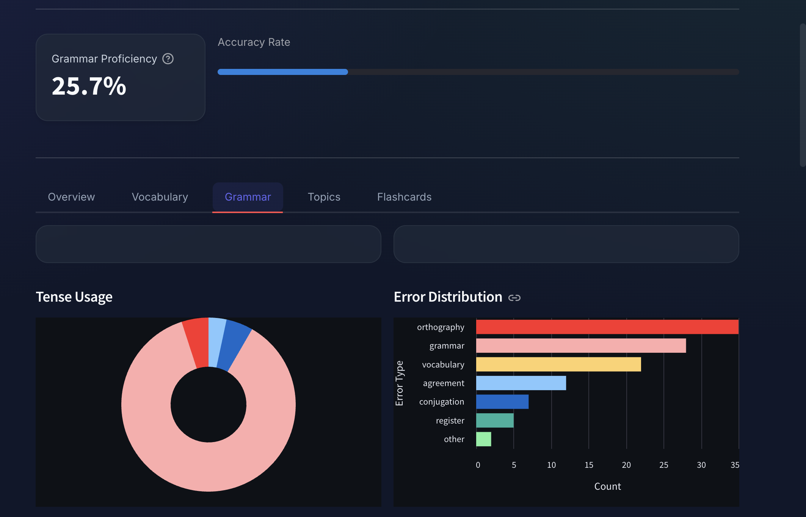
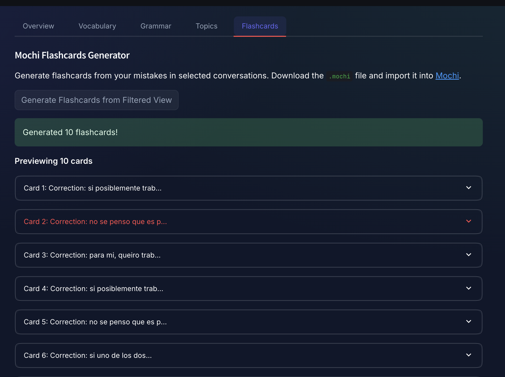

## Palabrero

<p align="center">
  
</p>

Palabrero is a Streamlit app that helps you practice Spanish conversation and tracks your progress with GPT‑powered analytics and vocabulary insights.

### Features

- **Chat tutor**:  
  - Chat in Spanish with an AI tutor guided by a custom `system_prompt.md`.  
  - Per-message analysis (tense, error types, topics, notable vocabulary) when GPT is available.

- **Roleplay scenarios**:  
  - Practice Spanish in specific contexts (e.g., "Café in Madrid", "Job Interview").  
  - Create, edit, and manage custom scenarios from the sidebar.  
  - The AI adapts its persona while maintaining correction behavior.

<p align="center">
  
</p>

- **Learning analytics dashboard**:  
  - **Tense usage** over time.  
  - **Error types** distribution (grammar, conjugation, vocabulary, etc.).  
  - **Topics** you speak about the most.  
  - **Vocabulary growth** and “new words per conversation”.  
  - Conversation summaries and message-level detail.

<p align="center">
  
</p>

<p align="center">
  
</p>

- **Mochi flashcards generator**:  
  - Generate flashcards from your mistakes in selected conversations.  
  - Review and delete individual cards before downloading.  
  - Export as `.mochi` files for import into [Mochi](https://mochi.cards/).

<p align="center">
  
</p>

- **Vocabulary tools**:  
  - Session vocabulary tracked for user and AI.  
  - Export vocabulary as CSV from the sidebar and from the analytics dashboard.

- **Chat history storage**:  
  - Save/load chats to/from a local SQLite database `palabrero.db`.  
  - Saved chats can be re‑analyzed and contribute to the analytics dashboard.

---

## Project Structure

- **`app.py`**: Streamlit entrypoint. Page config, session state, API key input, main UI flow (chat vs analytics), sidebar actions.
- **`chat.py`**: Chat flow:
  - Builds the messages list (system prompt + history + current user message).
  - Calls OpenAI chat completions.
  - Updates `st.session_state["chat_history"]` and triggers analysis.
- **`analysis.py`**:  
  - `ANALYSIS_MODEL = "gpt-4.1-mini"` (also used as the chat model).  
  - GPT-based `analyze_user_message` plus robust JSON parsing.  
  - Fallback heuristic analysis when GPT is unavailable.  
  - Allowed label sets for tenses, error types, topics, vocab categories.
- **`vocabulary.py`**:  
  - `extract_words`, `is_spanish_word` (placeholder), `update_vocabulary`, `rebuild_vocabulary_from_session`.
- **`storage.py`**:  
  - `initialize_database`, `save_chat`, `load_saved_chats`, `parse_chat_payload`, `load_chat`.  
  - Uses local SQLite DB `palabrero.db`.
- **`ui_components.py`**:  
  - `display_chat`, `display_vocabulary_metrics`, `display_scenario_manager`.  
  - `analytics_dashboard` with all charts/tables and flashcards tab.  
  - `export_vocabulary`.
- **`flashcards.py`**: Mochi flashcard generation:
  - `generate_cloze_cards`: Extracts mistakes from conversations.
  - `create_mochi_zip`: Creates `.mochi` (ZIP) files for import.
- **`scenarios.json`**: Roleplay scenario definitions (name, description, system prompt).
- **`system_prompt.md`**: Spanish‑tutor instructions/examples for the AI.  
- **`grammartypes.md`**: Reference guide / taxonomy of error types.  
- **`requirements.txt`**: Python dependencies.

---

## Requirements

- **Python**: 3.10+ recommended.
- **Dependencies** (from `requirements.txt`):
  - `streamlit==1.48.1`
  - `openai>=1.99.9`
  - `pandas==2.3.1`
  - `matplotlib`
  - Plus indirect deps (Altair, SQLite are part of stdlib/Streamlit stack).

Install dependencies:

```bash
pip install -r requirements.txt
```

---

## OpenAI API Configuration

You can supply your API key in two ways:

- **Via the UI (recommended for local use)**:  
  - Run the app (see below).  
  - In the left sidebar, under **“API Key Setup”**, paste your OpenAI API key (it’s stored only in `st.session_state`).

- **Via environment variable (optional)**:  
  - Set `OPENAI_API_KEY` in your shell and then manually assign it to `st.session_state["api_key"]` in the code if you want to skip typing it each session.

The app uses the modern OpenAI Python SDK (`OpenAI` client) and the **`chat.completions`** API with the `gpt-4.1-mini` model.

---

## Running the App

From the project root:

```bash
streamlit run app.py
```

Then open the URL Streamlit prints (usually `http://localhost:8501`).

### Basic workflow

1. **Set your OpenAI API key** in the sidebar.
2. **Select a roleplay scenario** (optional):
   - Choose from "Standard Tutor", "Café in Madrid", "Job Interview", or create your own.
   - The AI will adapt its persona to the selected scenario.
3. **Chat**:
   - Type a message in "Escribe tu mensaje en español".
   - Click **"Enviar"**.
   - Your message and the AI reply will appear in the main chat area.
4. **Save chats**:
   - Click **"Save Chat"** in the sidebar and enter a name.
   - The chat is saved to `palabrero.db`.
5. **Load chats**:
   - Use the **"Saved Chats"** dropdown in the sidebar to reload a conversation.
6. **Analytics dashboard**:
   - Select **"Analytics"** from the sidebar navigation.
   - Filter conversations and explore tense usage, error types, topics, and vocabulary growth.
7. **Generate flashcards**:
   - In the Analytics view, go to the **"Flashcards"** tab.
   - Click **"Generate Flashcards from Filtered View"**.
   - Review, delete unwanted cards, and download as `.mochi` for import into Mochi.
8. **Vocabulary export**:
   - Use **"Export Vocabulary"** in the sidebar (chat mode) or the download button in the analytics view.

---

## Data Storage

- **Database**: `palabrero.db` (SQLite) in the project root.
- **Table**: `chats(name TEXT PRIMARY KEY, history TEXT, saved_at TEXT)`.  
- **History format**:
  - When saving, the app stores a JSON payload:  
    - `{"messages": [...], "analytics": [...]}`  
  - On load, this is parsed into `st.session_state["chat_history"]` and `st.session_state["message_analytics"]`, then vocabulary is rebuilt.

---

## Customizing the Tutor

- **System behavior**:  
  - Edit `system_prompt.md` to change how the AI corrects errors, explains concepts, or interacts.
  - The "Standard Tutor" scenario uses this prompt by default.
- **Roleplay scenarios**:  
  - Edit `scenarios.json` to modify existing scenarios or add new ones.
  - Use the "Manage Scenarios" expander in the sidebar to create/delete scenarios via the UI.
- **Error taxonomy / tags**:  
  - Update `grammartypes.md` and (if needed) extend constants in `analysis.py` to add new error categories or labels.
- **Model choice**:  
  - Change `ANALYSIS_MODEL` in `analysis.py` and the code will automatically use the same model for chat and analytics.


